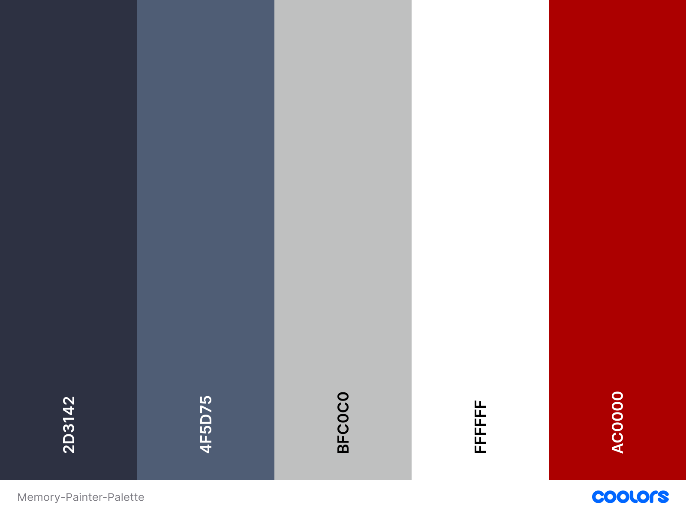

# Memory-Painter

[Memory Painter](https://gameringly.github.io/Memory-Painter/)

A game where the player must memorise a pattern of colours in a grid and then recreate that pattern with the correct colours, they are scored on how many tiles they got correct

screenshots

Contents

[Memory-Painter](#Memory-Painter)
  * [Rationale](#rationale)
  * [User Goals](#user-goals)
  * [User Stories](#user-stories)
  * [Website Goals and Objectives](#website-goals-and-objectives)
  * [Target Audience](#target-audience)
  * [Wireframes](#wireframes)
  * [Design Choices](#design-choices)
    + [Typography](#typography)
    + [Colour Scheme](#colour-scheme)
    + [Images](#images)
    + [Responsiveness](#responsiveness)
  * [Features](#features)
    + [Existing Features](#existing-features)
    + [Future Enhancements](#future-enhancements)
  * [Technologies Used](#technologies-used)
    + [Languages](#languages)
    + [Libraries and Framework](#libraries-and-framework)
    + [Tools](#tools)
  * [Testing](#testing)
    + [Bugs](#bugs)
    + [Responsiveness Test](#responsiveness-test)
    + [Code Validation](#code-validation)
      - [HTML](#html)
      - [CSS](#css)
    + [User Story Testing](#user-story-testing)
    + [Feature Testing](#feature-testing)
    + [Accessibility Testing](#accessibility-testing)
    + [Lighthouse Testing](#lighthouse-testing)
    + [Browser Testing](#browser-testing)
  * [Deployment](#deployment)
    + [To deploy the project](#to-deploy-the-project)
    + [To fork the project](#to-fork-the-project)
    + [To clone the project](#to-clone-the-project)
  * [Credits](#credits)

## Rationale

## User Goals

* Have fun with a quick and simple game
* Improve my memory by practicing
* User friendly navigation
* Adjust the challenge level to suit ability

## User Stories

* As a user, I want simple controls that are intuitive to understand
* As a user, I want to be able to adjust the difficulty to my liking
* As a user, I want to be able to reset the game easily
* As a user, I want clear feedback on my performance so that I can track my progress
* As a user, I want to be able to see where I made mistakes

## Website Goals and Objectives

* Provide a fun, casual memory-based puzzle game that challenges players
* Enable players to recreate patterns by clicking grid tiles
* Implement customizable grid sizes and reveal times
* Encourage replayability by offering various difficulty options
* Keep the design lightweight and responsive for smooth play on desktop and mobile.

## Target Audience

* Casual gamers
* Mobile and web users
* All ages

## Wireframes

Wireframe designed using Balsamiq tool.

[Home Page](docs/home-page.png)

## Design Choices

### Typography

The font family that was chosen was [Lato](https://fonts.google.com/specimen/Lato?query=lato), a rounded sans-serif font. Lato is clean and easy to read making it suitable for general use in the website.

### Colour Scheme

I chose to use a dull colour palette for the website to not distract players from remembering the grid colours

I used [Contrast Grid](https://contrast-grid.eightshapes.com/?version=1.1.0&background-colors&foreground-colors=%232d3142%0D%0A%234f5d75%0D%0A%23bfc0c0%0D%0A%23ffffff%0D%0A%23C20000&es-color-form__tile-size=compact&es-color-form__show-contrast=aaa&es-color-form__show-contrast=aa&es-color-form__show-contrast=aa18&es-color-form__show-contrast=dnp) to see what colour combinations have good contrast for text.

### Images

### Responsiveness

## Features

### Existing Features

### Future Enhancements

## Technologies Used

### Languages

### Libraries and Framework

### Tools

## Testing

### Bugs

player score isnt correct on repeat play

player can fill out grid during countdown and press check answer button to get the score

### Responsiveness Test

### Code Validation

#### HTML

#### CSS

### User Story Testing

### Feature Testing

### Accessibility Testing

### Lighthouse Testing

### Browser Testing

## Deployment

### To deploy the project

The website was deployed as soon as the index.html file was created with these steps:

* Navigate to the repository on GitHub and click on the settings tab.
* In the side menu, under the Code and automation section click on pages.
* In the Branch section click the dropdown that says None and choose Main.
* Click on the Save button.
* The website is now live at [https://gameringly.github.io/Memory-Painter/](https://gameringly.github.io/Memory-Painter/).

### To fork the project

Forking the GitHub repository will allow you to create a duplicate of the repository and website. This means you can make changes to the copy without affecting the original repository.

* Open the repository on Github
* Click the fork button which is to the right of the repository name
* Give it a new name and then press the create fork button

### To clone the project

Cloning the repository will create a local copy on your computer that you can use to make and sync changes to the repository

* Open the repository on Github
* Click on the green Code button
* Copy the URL for the repository.
* Open your local IDE.
* Select the location where you want the directory to be cloned to.
* Type git clone, and then paste the URL you copied earlier.
* Press Enter to create your local clone.

## Credits