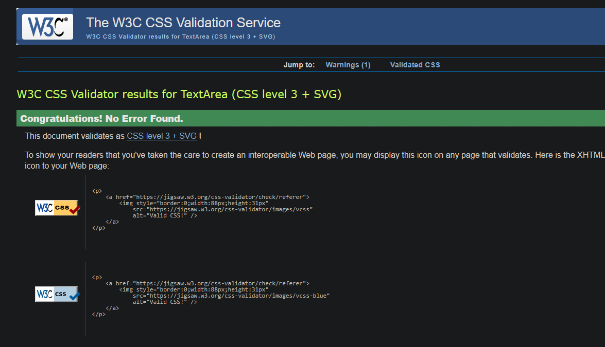
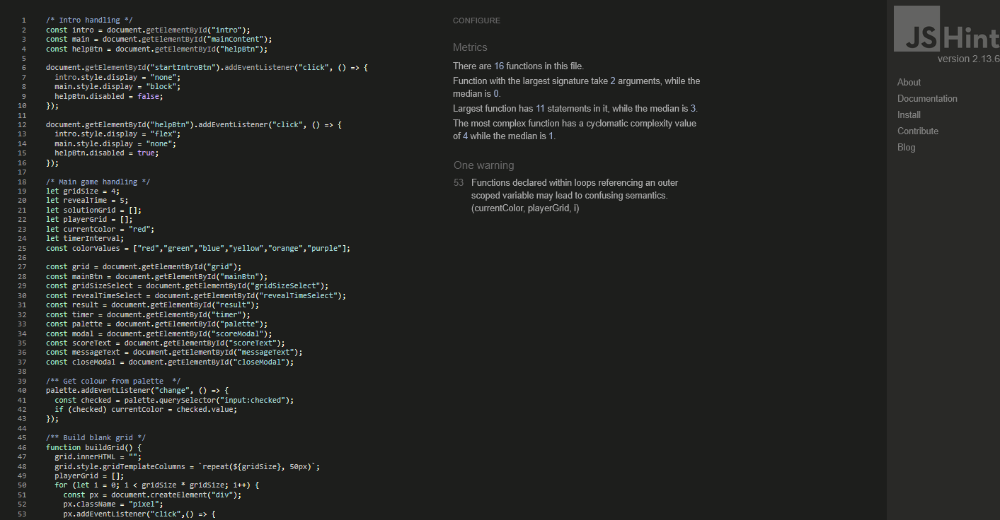
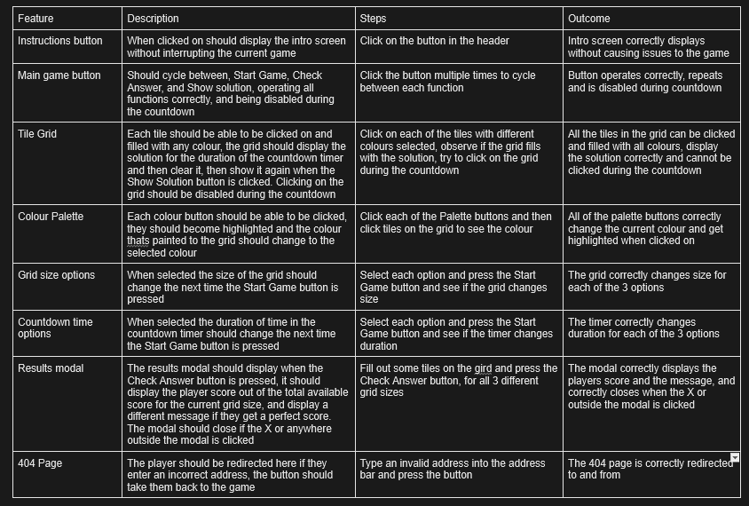
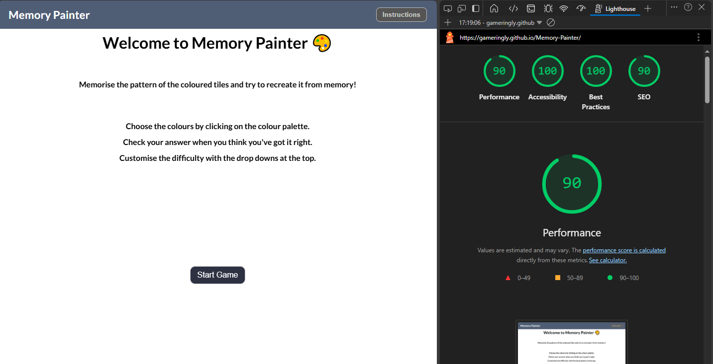

# Memory-Painter

[Memory Painter](https://gameringly.github.io/Memory-Painter/)

A game where the player must memorise a pattern of colours in a grid and then recreate that pattern with the correct colours, they are scored on how many tiles they got correct

Intro Screen

 

Main game Screen

 

Results Screen

 

404 Error Screen

 

Contents

[Memory-Painter](#Memory-Painter)
  * [User Goals](#user-goals)
  * [User Stories](#user-stories)
  * [Website Goals and Objectives](#website-goals-and-objectives)
  * [Target Audience](#target-audience)
  * [Wireframes](#wireframes)
  * [Design Choices](#design-choices)
    + [Typography](#typography)
    + [Colour Scheme](#colour-scheme)
    + [Responsiveness](#responsiveness)
  * [Features](#features)
    + [Existing Features](#existing-features)
    + [Future Enhancements](#future-enhancements)
  * [Technologies Used](#technologies-used)
    + [Languages](#languages)
    + [Libraries and Framework](#libraries-and-framework)
    + [Tools](#tools)
  * [Testing](#testing)
    + [Principles of manual and automated testing](#principles-of-manual-and-automated-testing)
    + [Bugs](#bugs)
    + [Responsiveness Test](#responsiveness-test)
    + [Code Validation](#code-validation)
      - [HTML](#html)
      - [CSS](#css)
    + [User Story Testing](#user-story-testing)
    + [Feature Testing](#feature-testing)
    + [Accessibility Testing](#accessibility-testing)
    + [Lighthouse Testing](#lighthouse-testing)
    + [Browser Testing](#browser-testing)
  * [Deployment](#deployment)
    + [To deploy the project](#to-deploy-the-project)
    + [To fork the project](#to-fork-the-project)
    + [To clone the project](#to-clone-the-project)
  * [Credits](#credits)

## User Goals

* Have fun with a quick and simple game
* Improve my memory by practicing
* User friendly navigation
* Adjust the challenge level to suit ability

## User Stories

* As a user, I want simple controls that are intuitive to understand
* As a user, I want to be able to adjust the difficulty to my liking
* As a user, I want to be able to reset the game easily
* As a user, I want clear feedback on my performance so that I can track my progress
* As a user, I want to be able to see where I made mistakes

## Website Goals and Objectives

* Provide a fun, casual memory-based puzzle game that challenges players
* Enable players to recreate patterns by clicking grid tiles
* Implement customizable grid sizes and reveal times
* Encourage replayability by offering various difficulty options
* Keep the design lightweight and responsive for smooth play on desktop and mobile.

## Target Audience

* Casual gamers
* Mobile and web users
* All ages

## Wireframes

Wireframes designed using Balsamiq tool.

[Intro screen](docs/intro-screen.png)

[Game screen](docs/game-screen.png)

[Results screen](docs/results-screen.png)

[Error 404 Page](docs/error404-page.png)

## Design Choices

### Typography

The font family that was chosen was [Lato](https://fonts.google.com/specimen/Lato?query=lato), a rounded sans-serif font. Lato is clean and easy to read making it suitable for general use in the website.

### Colour Scheme

I chose to use a dull colour palette for the website to not distract players from remembering the grid colours

I used [Contrast Grid](https://contrast-grid.eightshapes.com/?version=1.1.0&background-colors&foreground-colors=%232d3142%0D%0A%234f5d75%0D%0A%23bfc0c0%0D%0A%23ffffff%0D%0A%23C20000&es-color-form__tile-size=compact&es-color-form__show-contrast=aaa&es-color-form__show-contrast=aa&es-color-form__show-contrast=aa18&es-color-form__show-contrast=dnp) to see what colour combinations have good contrast for text.

### Responsiveness

Website has been designed for all elements to fit in the middle of the screen for all screen sizes

## Features

### Existing Features

#### Header

The header is positioned above all of the main content and is a dark blue-grey colour to make it stand out. The header contains the title of the site and a button that will take you back to the introduciton screen, this button is disabled while on the intro screen and this is shown by it being greyed out. This button is not present on the 404 error screen.

Header

 

#### Introduction screen

Before getting to the main content the player is shown an introduction screen that explains how to play the game with a button that takes them to the main game

Introduction

 

#### Tile Grid

A grid of tiles that can be clicked on to fill them with the currently selected colour. The grid can be either 3x3, 4x4, or 5x5 depending on the chosen option. When the game starts it will be filled with a random pattern of colours and cleared when the timer runs out. While the timer is running the grid cannot be clicked on. After the player has got their score it will display the original pattern again so they can see what they got right and wrong.

Grid

 

#### Colour palette

A row of 6 coloured buttons, clicking on one will highlight it and be set as your current colour to place on the grid, it has a line of text to make sure the player understands that this is what they need to click on.

Palette

 

#### Difficulty options

There are 2 drop down menus above the grid that allow the player to customise the size of the grid and the length of the countdown timer

Options

 

#### Main game button

The main game button controls the state of the game and changes to the next one when pressed. It will begin as the Start Game button that when pressed begins the countdown timer and displays the solution the player needs to memorise, during this time the button is disabled. Then it will switch to the Check Answer button that allows the player to submit their answer and display the results. Then it will switch to the show solution button which will display the original pattern to the player again and then reseting back to the Start Game button to repeat the game.

Check Answer Button

 

#### Countdown Timer

After the Start Game button is pressed a countdown will appear above the grid to display how much time the player has left to memorise the grid.

Countdown

 

#### Results Modal

After the player presses the Check Answer button the results modal will display to show their score and a message that will change if they get a perfect score. The modal can be closed by pressing the X or by clicking anywhere outside the modal, the results text is also displayed under the main button so the player can always see it until they start a new game.

Bad Results

 

Perfect Results

 

#### 404 Error Page

This page is shown if the player somehow enters an incorrect address, it has a button that takes the player back to the main page.

404 Page

 

### Future Enhancements

* Save the players best score
* Record the time it took for completion
* Add options for more or less colours

## Technologies Used

### Languages

* [HTML](https://developer.mozilla.org/en-US/docs/Glossary/HTML5)
* [CSS](https://developer.mozilla.org/en-US/docs/Web/CSS)
* [Javascript](https://developer.mozilla.org/en-US/docs/Web/JavaScript)

### Libraries and Framework

* [Google Fonts](https://fonts.google.com/)

### Tools

* [GitHub](https://github.com/)
* [Balsamiq](https://balsamiq.com/product/)
* [Coolors colour palette generator](https://coolors.co/)
* [Eight Shapes Contrast Grid](https://eightshapes.com/)
* [W3C HTML Validation Service](https://validator.w3.org/)
* [W3C CSS Validation Service](https://jigsaw.w3.org/css-validator/)
* [JSHint](https://jshint.com/)

## Testing

### Principles of manual and automated testing

Manual testing relies on humans executing tests step by step without automation to check test cases and make a report. Testers interact with the application directly and check if it behaves as expected. It takes time to do each test and there is a chance of human error.
Manual testing should be used when doing quick, informal tests after updates or bug fixes and when testing end-user usability. 

Automated testing uses scripts and automated tools to automatically run tests on the application. These tests are repeatable, fast, free from human errors, and can cover large parts of a system without human involvement. However the process of creating automated tests can take time.
Automated testing is best used in repetitive tasks such as running checks every time code is edited or simulating a large quantity of users.

### Bugs

The website was thoroughly tested throughout the development process and two major bugs were encountered during development which were both fixed.

| Bug                                              | Status | Description                                                                                                                                 | Steps to resolve                                                                                                                                         |
|--------------------------------------------------|--------|---------------------------------------------------------------------------------------------------------------------------------------------|----------------------------------------------------------------------------------------------------------------------------------------------------------|
| player score isnt correct on repeat play                   | Fixed  | The score would be incorrect upon restarting the game | Rebuild the grid on every new play to prevent data from the tiles being carried over                                      |
| player can fill out grid during countdown and press check answer button to get the score                     | Fixed  | The player could click on the grid while its displaying the answer and copy the solution, then press the check answer button before it disapears and get points for free                                                                                       | Disable the click functionality on both the grid and the main game button while the countdown timer is active to prevent any possible problems |

### Responsiveness Test

To test responsiveness I used FireFox responsive design mode on the deployed version of the site to test a variety of different screen sizes. I tested to check the functionality, content placement and alignment of elements at different break points

| Size     | Device                     | Functionality | Placement | alignment|
| -------- | -------------------------- | ------------- | --------- | -------- |
|    sm    | Galaxy Note 20 Android 11  |    good       |   good    |   good   |
|    sm    | Galaxy S20 Android 11      |    good       |   good    |   good   |
|    md    | iPad IpadOS 14.7.1         |    good       |   good    |   good   |
|    md    | Kindle Fire HDX Linux      |    good       |   good    |   good   |
|    lg    | Laptop with HiDPI screen   |    good       |   good    |   good   |
|    xl    | 1080p Full HD Television   |    good       |   good    |   good   |

### Code Validation

#### HTML

I have used [W3C HTML Validation Service](https://validator.w3.org/nu/#textarea) to test all the website and it came back with no errors

#### CSS

I have used [W3C CSS Validation Service](https://jigsaw.w3.org/css-validator/validator) to test the CSS code and it has returned no errors, only 1 warning that imported style sheets are not checked in direct input and file upload modes

#### Javascript

I have used [JSHint](https://jshint.com/) to test the Javascript code and it has returned with no errors

### User Story Testing

| User Story                                                              | Result                                                                                                  | Pass |
|-------------------------------------------------------------------------|---------------------------------------------------------------------------------------------------------|------|
| As a user, I want simple controls that are intuitive to understand           | Controls are kept simple with a single main button controlling the main game loop which with clear labels                                                        | yes  |
| As a user, I want to be able to adjust the difficulty to my liking      | Both grid size and memorization time can be customised when starting a game                                           | yes  |
| As a user, I want to be able to reset the game easily                              | The game will naturally repeat once the player has finished the current game                                               | yes  |
| As a user, I want clear feedback on my performance so that I can track my progress                            | Results modal clearly displays score information, and score information is still visible after closing the modal  | yes  |
| As a user, I want to be able to see where I made mistakes | Game will display the solution after the game has ended so players can see what was different                                                                    | yes  |

### Feature Testing

The website has been manually tested for functionality and the results put in this table

### Accessibility Testing

### Lighthouse Testing

The website performance and accessibility has been tested with Lighthouse testing tool on the main page and the 404 page

### Browser Testing

The website was tested for bugs and issues on multiple browsers including Firefox, Google Chrome and Microsoft Edge. No issues were found in any of the browsers and the website functioned as expected.

|         | desktop | mobile |
|---------|---------|--------|
| Chrome  | Pass    | Pass   |
| Firefox | Pass    | Pass   |
| Edge    | Pass    | Pass   |

## Deployment

### To deploy the project

The website was deployed as soon as the index.html file was created with these steps:

1. Navigate to the repository on GitHub and click on the settings tab.
2. In the side menu, under the Code and automation section click on pages.
3. In the Branch section click the dropdown that says None and choose Main.
4. Click on the Save button.
5. The website is now live at [https://gameringly.github.io/Memory-Painter/](https://gameringly.github.io/Memory-Painter/).

### To fork the project

Forking the GitHub repository will allow you to create a duplicate of the repository and website. This means you can make changes to the copy without affecting the original repository.

1. Open the repository on Github
2. Click the fork button which is to the right of the repository name
3. Give it a new name and then press the create fork button

### To clone the project

Cloning the repository will create a local copy on your computer that you can use to make and sync changes to the repository

1. Open the repository on Github
2. Click on the green Code button
3. Copy the URL for the repository.
4. Open your local IDE.
5. Select the location where you want the directory to be cloned to.
6. Type git clone, and then paste the URL you copied earlier.
7. Press Enter to create your local clone.

## Credits